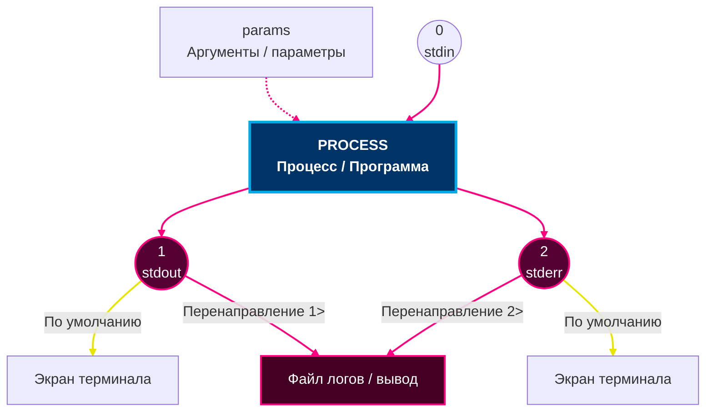

# Тема 8.2: Потоки ввода-вывода

В данной теме рассматриваются стандартные потоки ввода-вывода в Linux: `stdin` (ввод), `stdout` (вывод) и `stderr` (вывод ошибок). Разбираются перенаправление потоков, объединение потоков, команда `cat` для работы с файлами, а также практические примеры и исторический контекст.

---

## 1. Стандартные потоки ввода-вывода — Базовые свойства

- **Контекст/Уровень:** Системное администрирование / Работа с командной строкой.
- **Основное назначение:** Организация ввода и вывода данных между программами и системой.
- **Принцип работы:** Каждая программа (процесс) при запуске получает три стандартных потока, которые по умолчанию связаны с клавиатурой и терминалом.

| Поток | Дескриптор | Назначение | По умолчанию |
| :--- | :--- | :--- | :--- |
| `stdin` (standard input) | `0` | Ввод данных | Клавиатура |
| `stdout` (standard output) | `1` | Вывод результатов работы | Терминал |
| `stderr` (standard error) | `2` | Вывод сообщений об ошибках | Терминал |
*Таб. 1. Стандартные потоки ввода-вывода.*

> **Важное замечание:** Все три потока — это **файловые дескрипторы** (0, 1, 2). Они работают как каналы, через которые программа получает и отправляет данные. По умолчанию они связаны с терминалом, но их можно перенаправить в файлы или другие программы.

### 1.1. Схема работы потоков

**По умолчанию:**
- `stdout` (`1`) и `stderr` (`2`) выводятся на экран терминала.
- `stdin` (`0`) читается с клавиатуры.

**Интерактивная Mermaid-диаграмма:**



---

## 2. Перенаправление вывода (stdout)

### 2.1. Перенаправление в файл — `>`

```bash
command > file
```

- Создаёт файл (или перезаписывает существующий).
- Перенаправляет `stdout` в указанный файл.
- Ошибки (`stderr`) продолжают выводиться на экран.

**Пример:**
```bash
echo "Hello" > output.txt    # stdout уходит в файл, на экране ничего нет
cat output.txt               # Hello
```

> **Важно:** Если файл уже существовал, `>` **перезаписывает** его полностью. Если файла нет — он будет создан. Ошибки (`stderr`) при этом **не попадают** в файл — они остаются на экране.

### 2.2. Дозапись в файл — `>>`

```bash
command >> file
```

- Открывает файл для дозаписи (не перезаписывает).
- Новые данные добавляются в конец файла.

**Пример:**
```bash
echo "First line" > file.txt
echo "Second line" >> file.txt
cat file.txt
# First line
# Second line
```

---

## 3. Перенаправление ошибок (stderr)

### 3.1. Перенаправление stderr в файл — `2>`

```bash
command 2> error.log
```

- `2>` — перенаправляет поток `stderr` (дескриптор `2`).
- Ошибки записываются в файл, `stdout` выводится на экран.

> **Важно:** `2>` перенаправляет **только ошибки**. Если команда завершится успешно, файл с ошибками останется пустым. Это удобно для логирования.

### 3.2. Перенаправление stderr с дозаписью — `2>>`

```bash
command 2>> error.log
```

### 3.3. Раздельное перенаправление stdout и stderr

```bash
command > output.txt 2> error.txt
```

- `> output.txt` — `stdout` в `output.txt`.
- `2> error.txt` — `stderr` в `error.txt`.

---

## 4. Объединение потоков

### 4.1. Перенаправление stderr в stdout — `2>&1`

```bash
command > all.txt 2>&1
```

- `2>&1` — направляет `stderr` (`2`) туда же, куда направлен `stdout` (`1`).
- Оба потока объединяются и записываются в один файл.

> **Важно:** Синтаксис `2>&1` работает только если **`stdout` уже перенаправлен** (например, `> file`). Если написать просто `2>&1`, ошибки уйдут в терминал, но **не в файл**.

> **Примеры порядка операторов:**
> - `command 2>&1 > file` — **неправильный порядок**: сначала stderr уйдёт в текущий stdout (терминал), потом stdout в файл. Ошибки останутся на экране.
> - `command > file 2>&1` — **правильный порядок**: stdout в файл, потом stderr туда же.

### 4.2. Сокращённый синтаксис — `&>`

```bash
command &> all.txt
```

То же самое, что `> all.txt 2>&1` — оба потока в один файл.

### 4.3. Пример объединения

```bash
find / -name "*.sh" > found.txt 2>&1
```

И результаты поиска, и сообщения об ошибках (например, `Permission denied`) попадают в `found.txt`.

---

## 5. Перенаправление ввода (stdin)

### 5.1. Перенаправление из файла — `<`

```bash
command < file
```

Читает данные из файла как `stdin` вместо клавиатуры.

> **Важно:** Перенаправление `< file` используется для **чтения данных из файла** как ввода. Это удобно, когда команда ожидает ввод с клавиатуры, но данные уже есть в файле.

### 5.2. Создание файла с помощью `cat` и перенаправления

```bash
cat > file.txt
```

После выполнения команды:
- Терминал ожидает ввода с клавиатуры.
- Каждая строка добавляется в файл.
- `Ctrl + D` — завершить ввод (EOF).
- `Ctrl + C` — прервать (не рекомендуется, может оставить файл незавершённым).

> **Уточнение про `Ctrl + C`:** `Ctrl + C` **не завершает** файл корректно — он **прерывает** запись, и файл может остаться без завершающего символа EOF. Лучше использовать `Ctrl + D` для корректного завершения.

### 5.3. Дозапись с помощью `cat`

```bash
cat >> file.txt
```

Новые строки добавляются в конец существующего файла.

---

## 6. Команда `cat` для работы с файлами

`cat` (сокращение от "concatenate") — утилита для работы с содержимым файлов.

> **Важно:** Команда `cat` выводит содержимое файлов **последовательно**, без разделителей. Если нужно визуально разделить файлы, используйте `cat -n` (нумерация строк) или `cat file1 file2 | less`.

> **Пояснение про `cat -n`:** `cat -n` нумерует **все строки подряд**, а не разделяет файлы. Для разделения лучше использовать `cat file1 file2 | less` или `cat file1 file2 | grep -v '^$'` (убрать пустые строки).

### 6.1. Просмотр содержимого

```bash
cat file.txt
```

### 6.2. Объединение нескольких файлов

```bash
cat file1.txt file2.txt file3.txt
```

Выводит содержимое всех файлов последовательно.

### 6.3. Объединение с использованием wildcards

```bash
cat *.txt                 # все .txt файлы в текущей папке
cat report*               # все файлы, начинающиеся на report
```

### 6.4. Объединение с перенаправлением в новый файл

```bash
cat report2020.txt report2021.txt report2022.txt > united_report.txt
```

Создаёт файл `united_report.txt`, содержащий объединённое содержимое всех трёх файлов.

---

## 7. Перенаправление и `find`

Команда `find` часто используется в сочетании с перенаправлением потоков.

### 7.1. Поиск с сохранением результатов

```bash
find / -name "*.sh" -type f > bash_scripts.txt 2> errors.txt
```

- `stdout` (найденные файлы) — в `bash_scripts.txt`.
- `stderr` (ошибки доступа) — в `errors.txt`.

### 7.2. Поиск с объединением потоков

```bash
find / -name "*.sh" -type f &> all_output.txt
```

Все сообщения (и результаты, и ошибки) — в `all_output.txt`.

### 7.3. Игнорирование ошибок

```bash
find / -name "*.conf" 2> /dev/null
```

`/dev/null` — специальный файл, который отбрасывает все записанные в него данные. Это "чёрная дыра" Linux.

> **Важно:** `/dev/null` — это **специальное устройство**, которое отбрасывает все данные. Использование `2>/dev/null` скрывает ошибки, но **может скрыть важные сообщения** о проблемах. Используйте это осознанно.

### 7.4. Пример с явным указанием дескрипторов

```bash
find / -type f -name "*.sh" 1> bash_files.txt 2> errors.txt
```

- `1>` — результаты поиска в `bash_files.txt`.
- `2>` — ошибки в `errors.txt`.

```bash
find / -type f -name "*.sh" 1> all_results.txt 2>&1
```

- `1>` — результаты поиска в `all_results.txt`.
- `2>&1` — ошибки туда же, куда и результаты.

---

## 8. Сводная таблица перенаправления

| Оператор | Описание | Пример |
| :--- | :--- | :--- |
| `>` | Перенаправить `stdout` (перезапись) | `echo text > file` |
| `>>` | Перенаправить `stdout` (дозапись) | `echo text >> file` |
| `2>` | Перенаправить `stderr` (перезапись) | `command 2> err` |
| `2>>` | Перенаправить `stderr` (дозапись) | `command 2>> err` |
| `&>` | Перенаправить `stdout` и `stderr` (перезапись) | `command &> all` |
| `&>>` | Перенаправить `stdout` и `stderr` (дозапись) | `command &>> all` |
| `<` | Перенаправить `stdin` из файла | `command < file` |
| `2>&1` | Направить `stderr` туда же, куда `stdout` | `command > out 2>&1` |
*Таб. 2. Сводная таблица перенаправления потоков.*

> **Важно:** Порядок операторов имеет значение. Например, `2>&1 > file` — сначала ошибки уйдут в терминал, а потом `stdout` в файл. Правильный порядок — `> file 2>&1` (сначала stdout, потом ошибки).

---

## 9. Практические примеры

> **Важно:** Все примеры в этом разделе демонстрируют **базовые операции** с перенаправлением. В реальной работе эти команды часто комбинируются с `find`, `grep` или другими утилитами.

### 9.1. Создание нескольких файлов

```bash
echo "2020 data" > report2020.txt
echo "2021 data" > report2021.txt
echo "2022 data" > report2022.txt
```

### 9.2. Объединение файлов

```bash
cat report2020.txt report2021.txt report2022.txt > united.txt
```

### 9.3. Дозапись в объединённый файл

```bash
echo "2023 data" >> united.txt
```

### 9.4. Интерактивное создание файла

```bash
cat > console_input.txt
# Введите несколько строк
# Завершите ввод Ctrl+D
```

### 9.5. Поиск с разделением потоков

```bash
find / -name "*.conf" -type f > conf_files.txt 2> errors.txt
```

### 9.6. Создание файла с вводом из консоли

```bash
cat > new_file.txt
```

- Набираете текст (можно многострочный).
- Завершаете ввод через `Ctrl + D`.
- Файл создаётся, если его не было, или перезаписывается, если он существовал.

```bash
cat >> existing_file.txt
```

- Дописывает ввод в конец существующего файла.

---

## 10. Разбор сложных ситуаций и типичных вопросов

### 10.1. Разница между одинарными и двойными кавычками

**Вопрос:** *Есть ли разница, какие кавычки использовать в команде `echo` — одинарные или двойные?*

**Ответ:** Разница есть и она существенная:
- **Двойные кавычки:** оболочка интерпретирует специальные символы и переменные внутри них.
  ```bash
  name="Мир"
  echo "Привет, $name"   # Вывод: Привет, Мир
  ```
- **Одинарные кавычки:** оболочка не интерпретирует специальные символы и переменные. Всё воспринимается как обычный текст.
  ```bash
  name="Мир"
  echo 'Привет, $name'   # Вывод: Привет, $name
  ```

### 10.2. Использование `/dev/null`

**Вопрос:** *Как скрыть ошибки в терминале?*

**Ответ:** Используйте `2>/dev/null`. Это перенаправит поток ошибок в специальный файл `/dev/null`, который отбрасывает все данные. Пример:
```bash
find / -name "*.conf" 2> /dev/null
```

### 10.3. Команда `tee`

**Вопрос:** *Как записать вывод одновременно в файл и на экран?*

**Ответ:** Используйте команду `tee`. Она выводит данные и на стандартный вывод, и в файл(ы):
```bash
echo "Hello, World!" | tee file1.txt file2.txt
```
- На экране появится `Hello, World!`.
- Файлы `file1.txt` и `file2.txt` будут содержать `Hello, World!`.

> **Запись в несколько файлов одновременно:**  
> `tee` может записывать данные сразу в несколько файлов:
> ```bash
> echo "Hello, World!" | tee file1.txt file2.txt
> ```
> - На экране появится `Hello, World!`.
> - Оба файла (`file1.txt` и `file2.txt`) будут содержать ту же строку.

### 10.4. Исторический контекст появления потоков

**Вопрос:** *Откуда взялись потоки `stdin`, `stdout` и `stderr`?*

**Ответ:** Это **реальная история из 1969–1975 годов**, которую стоит знать, чтобы понимать, почему потоки называются именно так и почему они имеют такие дескрипторы.

**Эпоха телетайпов:**
В 1969 году Кен Томпсон и Деннис Ритчи работали с телетайпом Teletype Model 33 (ASR-33). Это была продвинутая электрическая печатная машинка, соединённая с компьютером по телефонному проводу.

- **`stdin` (поток 0):** Когда вы нажимали клавишу на физической клавиатуре, в компьютер улетал электрический сигнал. Это и был стандартный ввод.
- **`stdout` (поток 1):** Монитора не было. Вместо него в телетайп был заправлен огромный рулон бумаги. Когда компьютер хотел вам что-то ответить, он буквально стучал металлическими литерами по бумаге. Это был стандартный вывод.
- **Проблема:** В самых первых версиях Unix существовал только один выходной поток — `stdout`. Если происходила ошибка (например, на диске закончилось место), сообщение об ошибке записывалось **туда же**, куда и полезные данные. Если вы перенаправляли вывод в файл через `>`, ошибка попадала **внутрь этого файла**, портя его. А человек даже не узнавал о катастрофе, потому что на бумаге ничего не печаталось.

**Дуглас Макилрой и изобретение `stderr` (1974–1975):**
Программисты Bell Labs начали массово жаловаться на эту проблему. Дуглас Макилрой (тот самый, кто придумал конвейер `|` и перенаправление `>`) понял: одной выходной трубы для программы критически мало. Нужно разделить «полезный результат» и «жалобы».

В районе Четвёртой или Пятой редакции Unix в систему жёстко встроили третий поток — `stderr` (поток 2). Теперь:
- Если программа успешно выполнила задачу, она выводит данные в `stdout` (дескриптор 1).
- Если у программы что-то пошло не так, она **обязана** вывести сообщение об ошибке в `stderr` (дескриптор 2).

**Физический смысл `stderr`:**
По умолчанию в Unix сделали так: даже если пользователь перенаправляет `stdout` (цифра 1) в файл через `>`, поток `stderr` (цифра 2) остаётся намертво подключённым к телетайпу. Поэтому:
```bash
cat big_database.txt > new_archive.txt
```
Если произойдёт ошибка, полезные данные будут литься в файл, а сообщение об ошибке полетит по трубе `stderr`. Телетайп программиста внезапно оживёт и громко застучит по бумаге: «Внимание! Ошибка!». Файл останется чистым, а человек мгновенно увидит проблему.

**Как это помогает сегодня:**
Понимание этой истории объясняет синтаксис `2>&1`:
- `2>&1` буквально означает: «Возьми поток 2 (ошибки) и прикрути его к той же трубе, куда сейчас направлен поток 1 (вывод)».
- `ls /root 2> errors.txt` — если у вас нет прав доступа к папке `/root`, сообщение об ошибке тихо улетит в файл `errors.txt`, а результат останется на экране.
- `command > /dev/null 2>&1` — отправить и результат, и ошибки в «чёрную дыру» `/dev/null`.

---

### 10.5. Кавычки и `find`

**Вопрос:** *Нужно ли брать имена файлов в кавычки при использовании `find`?*

**Ответ:** Да, если в имени искомого файла используются спецсимволы (`*`, `?`, `[ ]`). Кавычки нужны, чтобы предотвратить раскрытие шаблона (glob) оболочкой. Без кавычек оболочка попытается раскрыть шаблон в текущей директории и передаст в `find` список файлов, а не шаблон. Пример:
```bash
find /home/ -name "*.txt"
```

> **Развёрнутое объяснение кавычек и `find`:**  
> Кавычки нужны не для команды `find`, а чтобы **предотвратить раскрытие шаблона (glob) оболочкой**.  
> - Без кавычек оболочка попытается раскрыть `*.txt` в **текущей директории** и передаст в `find` **список файлов**, а не шаблон.  
> - Если совпадений нет, оболочка передаст сам шаблон (например, `*.txt`), и `find` продолжит поиск с этим шаблоном.  
>  
> **Пример:**  
> ```bash
> find /home/ -name "*.txt"
> ```

### 10.6. Поток ввода — подробнее

**Вопрос:** *Что такое `stdin` и какие источники ввода существуют?*

**Ответ:** `stdin` — это канал, через который программа получает данные. Источники ввода:
- **Клавиатура** — ввод с терминала.
- **Файлы** — перенаправление `< file.txt`.
- **Другие программы** — конвейер `cmd1 | cmd2`.
- **Сеть** — данные из сетевых соединений.

**Примеры использования:**
```bash
# Ввод с клавиатуры (ожидает ввода)
cat

# Чтение из файла
wc -l < data.txt

# Конвейер (вывод grep становится вводом для wc)
grep "error" log.txt | wc -l

# Интерактивный ввод (ответы на вопросы программы)
mysql -u root -p
```

**Особенности:**
- Имеет файловый дескриптор `0`.
- По умолчанию связан с клавиатурой.
- Может быть перенаправлен из любого источника данных.
- Некоторые программы завершаются при закрытии `stdin`.

---

## 11. Лимиты, оптимизация и масштабирование

- **Перенаправление потоков:** Основной инструмент для автоматизации и логирования.
- **`/dev/null`:** Используется для отбрасывания ненужных данных.
- **`tee`:** Позволяет одновременно выводить данные и сохранять их в файл.
- **Ограничения `cat`:** `cat` не может редактировать файлы — только просматривать и объединять.
- **Порядок операторов:** При использовании `2>&1` важно сначала перенаправить `stdout` (`> file 2>&1`), иначе ошибки уйдут в терминал.

---

## 12. Расширенный ИБ-контекст и инженерный FAQ

### 1. Векторы атак и уязвимости (Security Context)

- **Логирование ошибок:** Если ошибки записываются в файл вместе с полезными данными, это может привести к порче данных. Важно разделять потоки (`> output.txt 2> error.txt`).
- **Отбрасывание ошибок:** Использование `2>/dev/null` может скрыть важные сообщения об ошибках, что затрудняет диагностику проблем. Однако если администратор **намеренно** скрывает ошибки (например, для чистоты вывода), это допустимо. Важно понимать, **какие именно ошибки** скрываются.
- **Использование `tee` для логирования:** Если `tee` используется для записи вывода в файл (например, `/var/log/app.log`), важно следить за правами на этот файл, чтобы злоумышленник не мог прочитать или изменить логи. Неправильные права могут привести к утечке чувствительной информации.

### 2. Инженерный FAQ

- **Вопрос:** *Что такое `stdin`, `stdout`, `stderr`?*  
  **Ответ:** Это три стандартных потока данных: ввод (`0`), вывод результатов (`1`), вывод ошибок (`2`).

- **Вопрос:** *Как объединить `stdout` и `stderr` в один файл?*  
  **Ответ:** Используйте `command > file 2>&1` или `command &> file`.

- **Вопрос:** *Что делает команда `tee`?*  
  **Ответ:** `tee` выводит данные одновременно на экран и в файл. Пример: `echo "Hello" | tee file.txt`.

---

## 13. Итоговая шпаргалка

| Тема | Описание |
| :--- | :--- |
| `stdin` (`0`) | Стандартный ввод (по умолчанию — клавиатура). |
| `stdout` (`1`) | Стандартный вывод результатов (по умолчанию — терминал). |
| `stderr` (`2`) | Стандартный вывод ошибок (по умолчанию — терминал). |
| `>` | Перенаправление `stdout` (перезапись). |
| `>>` | Перенаправление `stdout` (дозапись). |
| `2>` | Перенаправление `stderr` (перезапись). |
| `2>>` | Перенаправление `stderr` (дозапись). |
| `&>` | Перенаправление `stdout` и `stderr` вместе. |
| `2>&1` | Объединение `stderr` с `stdout`. |
| `<` | Перенаправление `stdin` из файла. |
| `cat` | Просмотр, объединение и создание файлов. |
| `/dev/null` | Специальный файл для отбрасывания данных. |
| `whatis echo` | Показать описание команды `echo` (вывод текста). |
| `whatis cat` | Показать описание команды `cat` (объединение файлов). |
*Таб. 3. Итоговая шпаргалка.*

### Ключевые выводы:

- Каждая программа имеет три стандартных потока: ввод, вывод, вывод ошибок.
- Перенаправление позволяет управлять тем, куда попадают эти потоки.
- `>` перезаписывает файл, `>>` дописывает в конец.
- Ошибки можно обрабатывать отдельно от обычного вывода.
- Объединение потоков (`2>&1`) полезно для сбора всей информации в один файл.

---

## Заключение

В этой теме были рассмотрены стандартные потоки ввода-вывода (`stdin`, `stdout`, `stderr`), их перенаправление и объединение. Понимание этих механизмов является основой для эффективной работы с командной строкой, автоматизации задач и обработки данных в Linux.